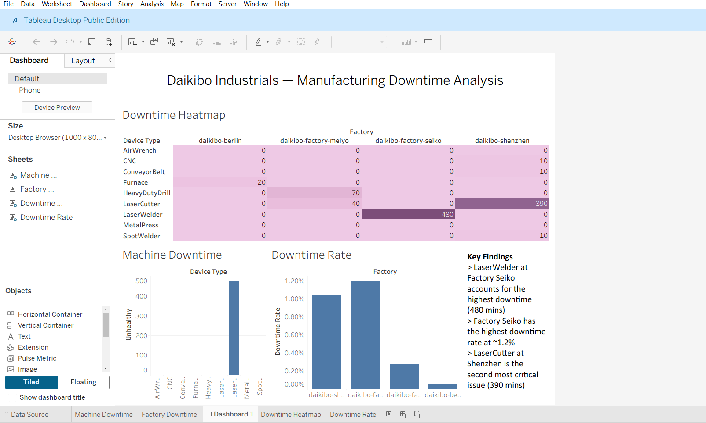

# Telemetry Data Analysis Using Tableau 

## Business Context
Daikibo Industrials operates 4 global manufacturing facilities across Germany, Japan, and China. 
Each machine transmits telemetry data every 10 minutes reporting either a healthy or unhealthy 
status. With hundreds of machines across 4 factories, identifying where downtime is concentrated 
is critical for maintenance prioritisation and operational efficiency.

## Business Question
Which factories and machine types are driving the most downtime — and where should maintenance 
teams focus first?

## Dataset
- Source: Daikibo telemetry data (JSON format)
- Coverage: 4 factories, 9 machine types
- Fields: Device ID, Device Type, Status (healthy/unhealthy), Timestamp, Location

## Tools
- Tableau (data visualisation and dashboard)

## Key Findings
- **LaserWelder at Factory Seiko** accounts for the highest downtime at 480 minutes — 
  the single most critical failure point across all facilities
- **Factory Seiko** has the highest downtime rate at ~1.2% of total monitored time, 
  followed by Shenzhen at ~1.05%
- **LaserCutter at Shenzhen** is the second most critical machine-factory combination 
  at 390 minutes
- **Berlin facility** is near zero across all machine types — lowest risk site

## Recommendation
Maintenance resources should be prioritised at Factory Seiko's LaserWelder as an immediate 
action, followed by investigation of the LaserCutter at Shenzhen. Berlin requires minimal 
intervention. A targeted maintenance schedule for these two machine-factory combinations 
would address the majority of recorded downtime.

## Dashboard
View the interactive Tableau dashboard here:
[Daikibo Manufacturing Downtime Dashboard](https://public.tableau.com/app/profile/nancy.abraham5565/viz/DeloitteSim_1/Dashboard1)

